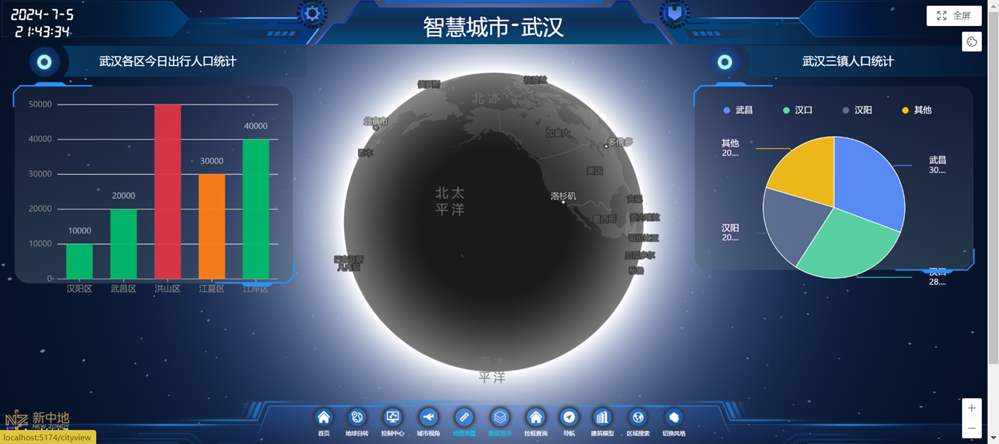
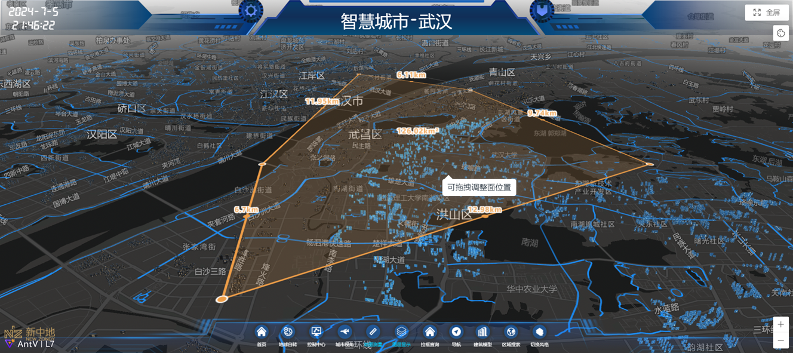
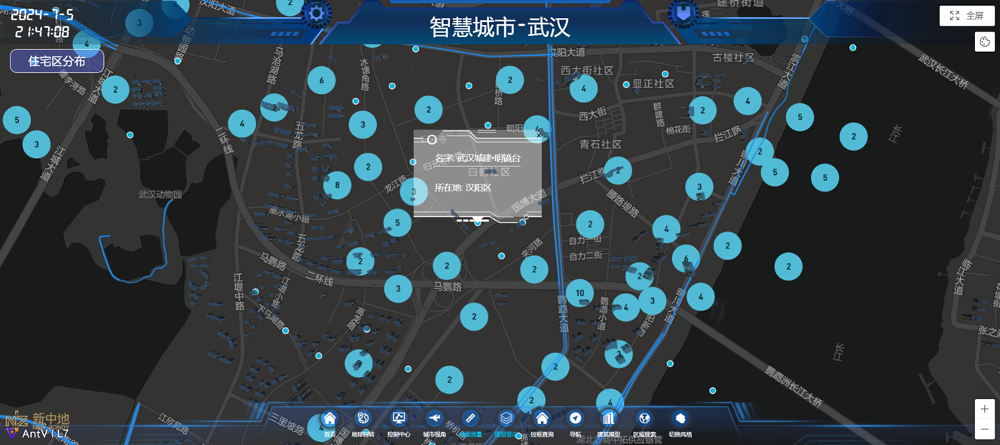
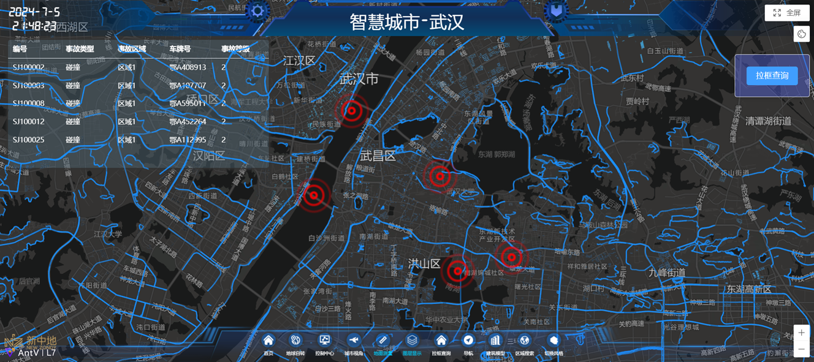
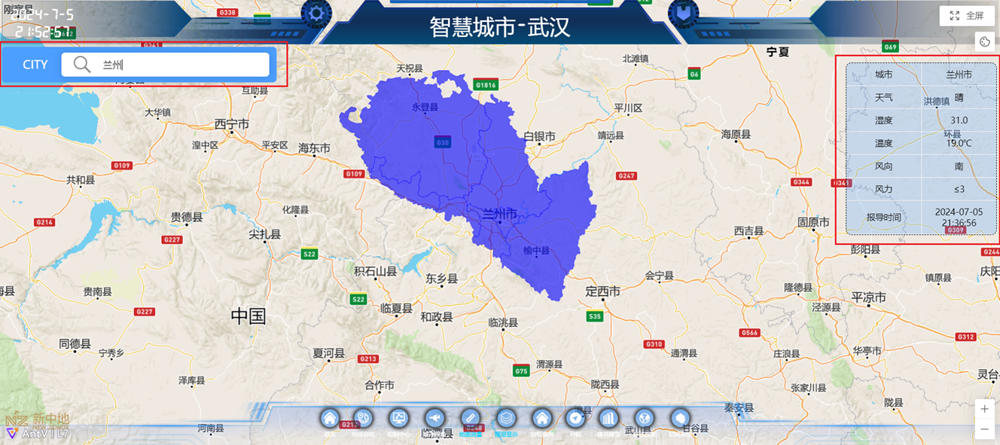

# 🌐 智慧城市-武汉 WebGIS 综合可视化平台


## 📝 项目简介
本项目为一个综合性的 WebGIS 结课开发实践项目。系统以“智慧城市-武汉”为核心研究区域，采用前后端分离架构，结合开源 WebGIS 技术栈。通过整合城市路网、建筑白模、POI、交通事故及人口统计等多元空间数据，实现了从宏观地球视角到微观街道模型的全方位展示。全面提升了地理信息系统的交互性、可视化效果与实用性。

## ✨ 核心功能模块 (Features)

本项目的功能模块与 `src/views/` 目录下的组件高度解耦，主要包含以下亮点：

* 🌍 **宏观与微观视角切换**
    * **地球自转展示 (`Rotation.vue`)**: 炫酷的 3D 地球开场，支持无缝缩放至城市级别。
    * **城市扫光与视角跟随 (`CityView.vue`)**: 动态扫光特效，增强城市建筑群的立体感与科技感。
* 📊 **多维度空间数据可视化**
    * **图表联动呈现 (`G2Charts.vue`)**: 结合 G2plot，直观展示武汉各区今日出行人口统计、武汉三镇人口比例等属性数据。
    * **特征图层叠加 (`LayerDisplay.vue`)**: 基于高德 POI 数据，可视化展示住宅区、医院、商场等特定类型的空间分布（气泡图/热力图）。
    * **3D 建筑模型加载 (`ModelView.vue`)**: 精准加载解析 `.obj` 格式的三维厂房/建筑模型。
* 🛠️ **专业地图分析工具**
    * **空间测量工具 (`MapDraw.vue`)**: 提供地图上的两点距离测量、多边形面积测量功能。
    * **拉框空间查询 (`EventInfo.vue`)**: 在地图上绘制矩形范围，实时查询并展示区域内的交通事故点位及详细信息。
* 📍 **便民 GIS 服务**
    * **跨区路径导航 (`Navigation.vue`)**: 基于地图 API 的路径规划功能（支持驾车、步行等模式）。
    * **区域天气检索 (`AreaSearch.vue`)**: 动态检索并展示指定行政区划的天气、温湿度及风向信息。
    * **底图风格自由切换 (`ChangeStyle.vue`)**: 提供卫星影像、高对比度街道、暗色模式、夜间导航等多种底图风格切换。

## 🏗️ 系统架构与技术栈

### 前端应用 (Frontend)
* **核心框架**: Vue 3 (采用 Composition API 构建)
* **构建工具**: Vite
* **地图渲染底座**: AntV-L7 (阿里开源空间数据可视化引擎) / Mapbox
* **地理空间分析**: Turf.js (用于前端拓扑分析与几何计算)
* **图表与UI**: G2plot / 纯 CSS 定制化大屏 UI
* **状态与逻辑复用**: 自定义 Vue Hooks (`useLeftBottom.js`, `useRightTop.js` 等)

### 后端与 GIS 服务 (Backend & GIS Server)
* **GIS 服务器**: GeoServer (用于发布 WMS/WFS 地图服务)
* **Web 服务器**: Tomcat
* **空间数据库**: PostgreSQL + PostGIS 扩展

### 数据预处理 (Data Pipeline)
* **语言与库**: Python (Requests, Pandas)
* **脚本路径**: `Pyscripts/extractCSV.py`
* **处理流程**: 通过高德 API 爬取 POI 数据 -> 使用 Pandas 进行数据清洗（去重、空值处理、经纬度边界过滤）-> 导出为 CSV -> 转换为 Shapefile 导入数据库。

## 📁 核心目录结构
```text
SMART-CITY/
├── Pyscripts/               # Python 数据获取与预处理脚本
│   ├── extractCSV.py        # POI 清洗脚本
│   ├── poiDataCSV/          # 清洗后的各类 POI 数据
│   └── poiDataShp/          # 转换好的 SHP 矢量数据
├── src/                     # 前端源码
│   ├── assets/              
│   │   ├── GIS_Data/        # 本地 GeoJSON 静态空间数据
│   │   └── models/          # 3D 建筑 obj 模型
│   ├── components/          # 页面基础组件 (Header, BottomTools)
│   ├── Hooks/               # 业务逻辑抽离，管理各面板状态
│   ├── router/              # 路由配置模块
│   ├── tools/               # 核心 GIS 工具类
│   │   ├── initControl.js   # 地图控件初始化
│   │   ├── initLayer.js     # 图层加载与管理
│   │   └── loadObjModels.js # 3D 模型解析器
│   ├── views/               # 十一大核心功能视图组件
│   ├── App.vue
│   └── main.js
├── public/                  # 静态资源
├── package.json             # 依赖管理
└── vite.config.js           # 构建配置
```

## 🗄️ 数据来源说明
本项目严格遵守数据开源协议，数据来源于：
1.  **建筑物及楼高数据**: 论文公开数据集《Vectorized rooftop area data for 90 cities in China》 (国家青藏高原科学数据中心)。
2.  **城市路网数据**: OpenStreetMap (OSM) 提取。
3.  **3D 模型数据**: 爱给 3D 模型网。
4.  **POI 兴趣点数据**: 高德地图开放平台 API 获取。
5.  **人口及统计数据**: 武汉市统计局公开统计公报。

## 🚀 部署与运行指南

### 1. 前置环境要求
* Node.js (建议 v16+)
* pnpm (推荐使用，可通过 `npm install -g pnpm` 安装)
* *(可选但推荐)* 本地或云端已配置好的 GeoServer 与 PostgreSQL+PostGIS 环境。

### 2. GIS 数据发布 (GeoServer 篇)
1. 将 `Pyscripts/poiDataShp` 中的 Shapefile 以及您收集的路网、建筑 shp 文件导入 PostGIS 数据库。
2. 在 GeoServer 中创建工作空间，连接 PostGIS 存储仓库。
3. 依次发布图层，并配置相应的 SLD 样式。记录下 WMS/WFS 的服务地址。

### 3. 前端项目运行
```bash
# 克隆项目到本地
git clone [https://github.com/您的用户名/您的仓库名.git](https://github.com/您的用户名/您的仓库名.git)
cd SMART-CITY

# 安装项目依赖
pnpm install

# 配置环境变量
# 请在根目录创建 .env 文件，并填入您的地图 API 密钥及 GeoServer 地址
# 例如：
# VITE_AMAP_KEY=your_gaode_map_api_key
# VITE_GEOSERVER_URL=http://localhost:8080/geoserver/wms

# 启动本地开发服务器
pnpm dev
```

## 📷 系统截图
*G2plot图表绘制

*地图测量工具

*特征图层叠加

*拉框查询交通事故

*3D建筑模型展示

*区域天气检索

*多种地图风格切换


## 🤝 贡献与许可
本项目为课程结课实验项目，暂未完全开放协作。如需参考或交流，欢迎提交 Issue。
